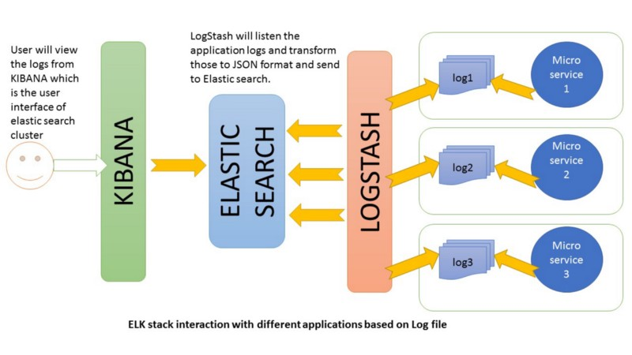
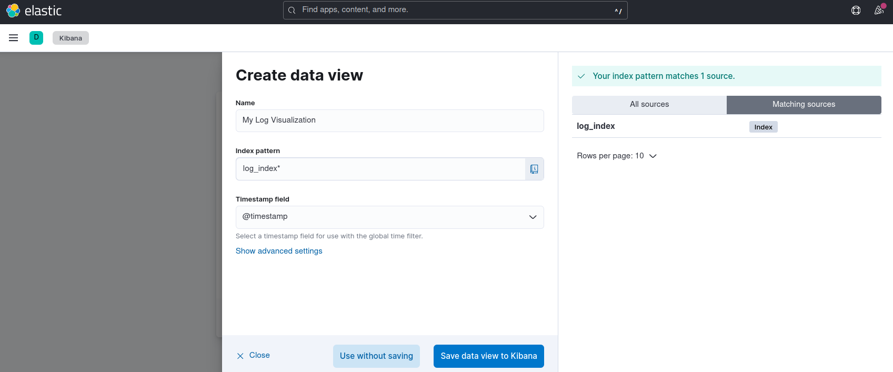
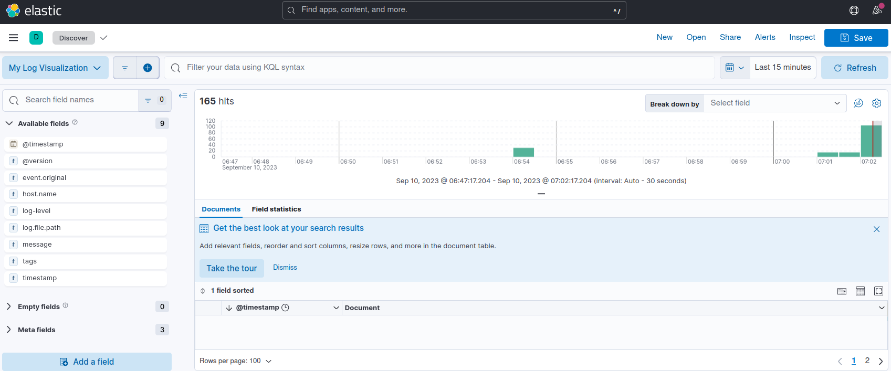
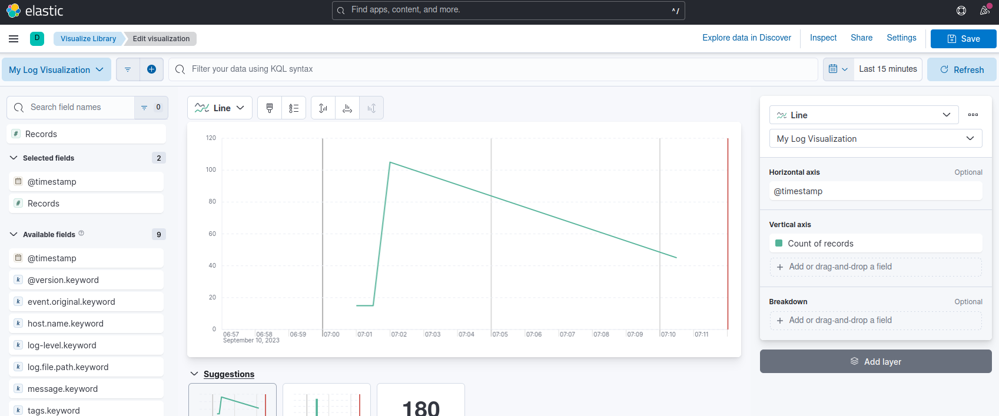
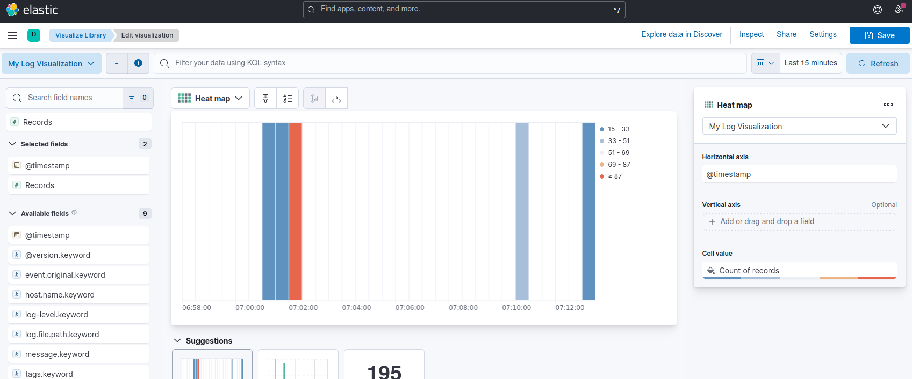
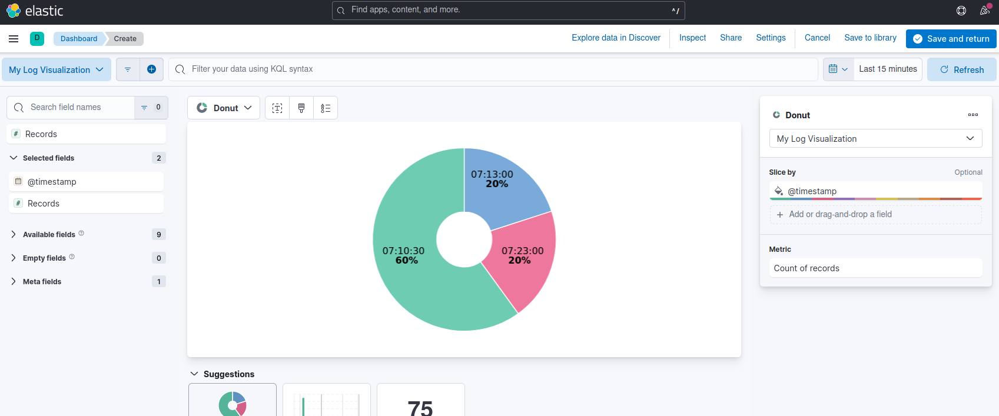
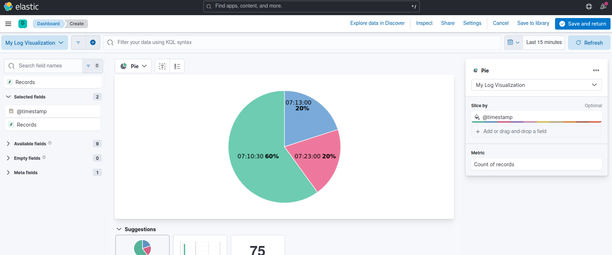
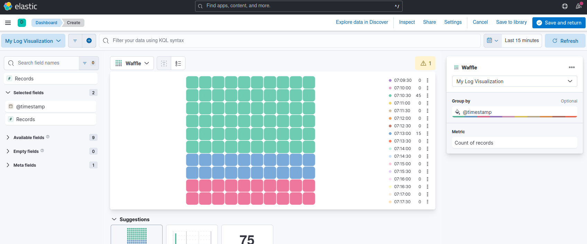

# Log_Visualizer

This Project used Elasticsearch, Logstash and Kibana to visualize logs in Python in realtime.

## How to Run?

- `docker-compose up`
- Goto Kibana (http://localhost:5601)
- Analytics Discover, put the settings as follows 
- **Boom** done

## Sample graphs

- Bar Graph 
- Line graph 
- Heat Map 
- Donut graph 
- Pie graph 
- Waffle graph 
